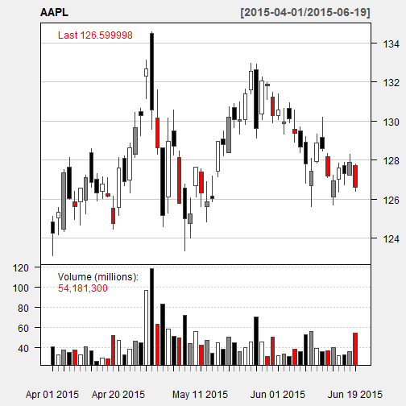
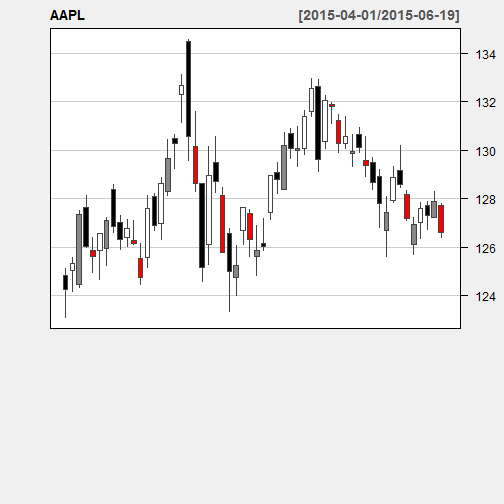
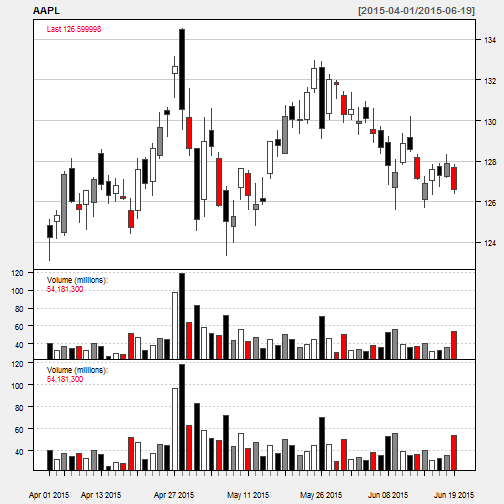

## Stock Analysis Introduction
- The application to utilize library quantmod in order to:
  > - Stock Analysis and Prediction : SAP
  > - Polling stock data from some providers
  > - Analyze data and output with trend charts from varies of durations: all, 1 month, 3 months, 6 months, 1 year
  > - Add finance indicators in order to have the better information to decide and predict more precisely for the stock quote next prices

- The target of this application is to predict the stock value --> we can extend by adding machine learning for this purpose. With this application, user can:
  > - Select a stock symbol
  > - Select an interested analysis duration
  > - Select technical indicators

--- .class #Stock Analysis Introduction

## Stock Analysis Introduction - Cont 1
- User can select the interest duration via slider bar
- User can view the downloaded data from server and download to local PC
- The application is in opened status, which is still needed to receive ideas, comments, feedbacks and even community contributions
- Application is simple and in draft version, enough for demonstration the idea only

--- .class #Stock Analysis Introduction - Cont 1


## Quantmod library overview

- Quantitative Financial Modelling & Trading Framework
- Designed to assist the quantitative trader in the development, testing, and deployment of statistically based trading models
- Provide a series of technical indicator which helps investors to get more information for their decisions

--- .class #Quantmod library overview

## How SAP work - Getting and Filtering data


- Download the stock data


```r
# To initialize and new environment for caching purpose
system_environment <- new.env()
symbol_data <- downloadSymbol(system_environment, "AAPL")
```

```
## Warning in download.file(paste(yahoo.URL, "s=", Symbols.name, "&a=",
## from.m, : downloaded length 156146 != reported length 200
```

- Filter data via a specific duration

```r
in_duration_data <- last(symbol_data, "3 months")
```

--- .class #How SAP work - Getting and Filtering data


## How SAP work - Plotting result

- Render candle chart and Add technical indicators

 

```
## Error in n < 1: comparison (3) is possible only for atomic and list types
```

```
## Error in x@params$n[li]: object of type 'S4' is not subsettable
```

```
## An object of class "chob"
## Slot "device":
## [1] 2
## 
## Slot "call":
## chartSeries(x = c(124.82, 125.029999, 124.470001, 127.639999, 
## 125.849998, 125.849998, 125.949997, 128.369995, 127, 126.410004, 
## 126.279999, 125.550003, 125.57, 128.100006, 126.989998, 128.300003, 
## 130.490005, 132.309998, 134.460007, 130.160004, 128.639999, 126.099998, 
## 129.5, 128.149994, 126.559998, 124.769997, 126.68, 127.389999, 
## 125.599998, 126.150002, 127.410004, 129.070007, 128.380005, 130.690002, 
## 130, 130.070007, 131.600006, 132.600006, 130.339996, 131.860001, 
## 131.229996, 130.279999, 129.860001, 130.660004, 129.580002, 129.5, 
## 128.899994, 126.699997, 127.919998, 129.179993, 128.190002, 126.099998, 
## 127.029999, 127.720001, 127.230003, 127.709999, 125.120003, 125.559998, 
## 127.510002, 128.119995, 126.400002, 126.580002, 127.209999, 128.570007, 
## 127.290001, 127.129997, 127.099998, 126.139999, 128.119995, 128.199997, 
## 128.869995, 130.419998, 130.630005, 133.130005, 134.539993, 131.589996, 
## 128.639999, 130.130005, 130.570007, 128.449997, 126.75, 126.080002, 
## 127.620003, 127.559998, 126.879997, 127.190002, 128.949997, 129.490005, 
## 130.720001, 130.880005, 130.979996, 131.630005, 132.970001, 132.910004, 
## 132.259995, 131.949997, 131.449997, 131.389999, 130.660004, 130.940002, 
## 130.580002, 129.690002, 129.210007, 128.080002, 129.339996, 130.179993, 
## 128.330002, 127.239998, 127.849998, 127.879997, 128.309998, 127.82, 
## 123.099998, 124.190002, 124.330002, 125.980003, 124.970001, 124.660004, 
## 125.260002, 126.610001, 125.910004, 126.010002, 126.110001, 124.459999, 
## 125.169998, 126.669998, 126.32, 128.139999, 129.229996, 131.149994, 
## 129.570007, 128.300003, 124.580002, 125.300003, 128.259995, 125.779999, 
## 123.360001, 124.019997, 126.110001, 125.629997, 124.82, 125.870003, 
## 127.160004, 128.210007, 128.360001, 129.639999, 129.339996, 129.830002, 
## 131.399994, 129.119995, 130.050003, 131.100006, 129.899994, 130.050003, 
## 129.320007, 129.899994, 128.910004, 128.360001, 126.830002, 125.620003, 
## 127.849998, 128.479996, 127.110001, 125.709999, 126.370003, 126.739998, 
## 127.220001, 126.400002, 124.25, 125.32, 127.349998, 126.010002, 
## 125.599998, 126.559998, 127.099998, 126.849998, 126.300003, 126.779999, 
## 126.169998, 124.75, 127.599998, 126.910004, 128.619995, 129.669998, 
## 130.279999, 132.649994, 130.559998, 128.639999, 125.150002, 128.949997, 
## 128.699997, 125.800003, 125.010002, 125.260002, 127.620003, 126.32, 
## 125.870003, 126.010002, 128.949997, 128.770004, 130.190002, 130.070007, 
## 130.059998, 131.389999, 132.539993, 129.619995, 132.039993, 131.779999, 
## 130.279999, 130.539993, 129.960007, 130.119995, 129.360001, 128.649994, 
## 127.800003, 127.419998, 128.880005, 128.589996, 127.169998, 126.919998, 
## 127.599998, 127.300003, 127.879997, 126.599998, 40621400, 32220100, 
## 37194000, 35012300, 37329200, 32484000, 40188000, 36365100, 25524600, 
## 28970400, 28369000, 51957000, 47054300, 32435100, 37654500, 45770900, 
## 44525900, 96954200, 118924000, 63386100, 83195400, 58512600, 
## 50988300, 49271400, 72141000, 43940900, 55550400, 42035800, 47109200, 
## 34322000, 44487500, 37921200, 50176600, 44351200, 35965000, 39307500, 
## 45123800, 70193700, 45662800, 30647300, 50338200, 31956000, 33556900, 
## 30889400, 38229300, 35314200, 52538200, 55771500, 38915900, 35260400, 
## 36754200, 39842600, 31404000, 32768500, 35241100, 54181300, 123.733159, 
## 124.798707, 126.820262, 125.48584, 125.077542, 126.033547, 126.571302, 
## 126.322342, 125.774634, 126.252633, 125.64517, 124.231079, 127.069222, 
## 126.382098, 128.084976, 129.130611, 129.738075, 132.098211, 130.016909, 
## 128.104897, 124.629416, 128.413605, 128.164645, 125.276714, 124.489999, 
## 125.260002, 127.620003, 126.32, 125.870003, 126.010002, 128.949997, 
## 128.770004, 130.190002, 130.070007, 130.059998, 131.389999, 132.539993, 
## 129.619995, 132.039993, 131.779999, 130.279999, 130.539993, 129.960007, 
## 130.119995, 129.360001, 128.649994, 127.800003, 127.419998, 128.880005, 
## 128.589996, 127.169998, 126.919998, 127.599998, 127.300003, 127.879997, 
## 126.599998), type = "candlesticks", subset = NULL, show.grid = TRUE, 
##     name = "AAPL", time.scale = NULL, log.scale = FALSE, TA = "addVo()", 
##     theme = "white", major.ticks = "auto", minor.ticks = TRUE, 
##     color.vol = TRUE, multi.col = TRUE)
## 
## Slot "xdata":
```

```
## Warning: timezone of object (UTC) is different than current timezone ().
```

 

```
##            AAPL.Open AAPL.High AAPL.Low AAPL.Close AAPL.Volume
## 2015-04-01    124.82    125.12   123.10     124.25    40621400
## 2015-04-02    125.03    125.56   124.19     125.32    32220100
## 2015-04-06    124.47    127.51   124.33     127.35    37194000
## 2015-04-07    127.64    128.12   125.98     126.01    35012300
## 2015-04-08    125.85    126.40   124.97     125.60    37329200
## 2015-04-09    125.85    126.58   124.66     126.56    32484000
## 2015-04-10    125.95    127.21   125.26     127.10    40188000
## 2015-04-13    128.37    128.57   126.61     126.85    36365100
## 2015-04-14    127.00    127.29   125.91     126.30    25524600
## 2015-04-15    126.41    127.13   126.01     126.78    28970400
## 2015-04-16    126.28    127.10   126.11     126.17    28369000
## 2015-04-17    125.55    126.14   124.46     124.75    51957000
## 2015-04-20    125.57    128.12   125.17     127.60    47054300
## 2015-04-21    128.10    128.20   126.67     126.91    32435100
## 2015-04-22    126.99    128.87   126.32     128.62    37654500
## 2015-04-23    128.30    130.42   128.14     129.67    45770900
## 2015-04-24    130.49    130.63   129.23     130.28    44525900
## 2015-04-27    132.31    133.13   131.15     132.65    96954200
## 2015-04-28    134.46    134.54   129.57     130.56   118924000
## 2015-04-29    130.16    131.59   128.30     128.64    63386100
## 2015-04-30    128.64    128.64   124.58     125.15    83195400
## 2015-05-01    126.10    130.13   125.30     128.95    58512600
## 2015-05-04    129.50    130.57   128.26     128.70    50988300
## 2015-05-05    128.15    128.45   125.78     125.80    49271400
## 2015-05-06    126.56    126.75   123.36     125.01    72141000
## 2015-05-07    124.77    126.08   124.02     125.26    43940900
## 2015-05-08    126.68    127.62   126.11     127.62    55550400
## 2015-05-11    127.39    127.56   125.63     126.32    42035800
## 2015-05-12    125.60    126.88   124.82     125.87    47109200
## 2015-05-13    126.15    127.19   125.87     126.01    34322000
## 2015-05-14    127.41    128.95   127.16     128.95    44487500
## 2015-05-15    129.07    129.49   128.21     128.77    37921200
## 2015-05-18    128.38    130.72   128.36     130.19    50176600
## 2015-05-19    130.69    130.88   129.64     130.07    44351200
## 2015-05-20    130.00    130.98   129.34     130.06    35965000
## 2015-05-21    130.07    131.63   129.83     131.39    39307500
## 2015-05-22    131.60    132.97   131.40     132.54    45123800
## 2015-05-26    132.60    132.91   129.12     129.62    70193700
## 2015-05-27    130.34    132.26   130.05     132.04    45662800
## 2015-05-28    131.86    131.95   131.10     131.78    30647300
## 2015-05-29    131.23    131.45   129.90     130.28    50338200
## 2015-06-01    130.28    131.39   130.05     130.54    31956000
## 2015-06-02    129.86    130.66   129.32     129.96    33556900
## 2015-06-03    130.66    130.94   129.90     130.12    30889400
## 2015-06-04    129.58    130.58   128.91     129.36    38229300
## 2015-06-05    129.50    129.69   128.36     128.65    35314200
## 2015-06-08    128.90    129.21   126.83     127.80    52538200
## 2015-06-09    126.70    128.08   125.62     127.42    55771500
## 2015-06-10    127.92    129.34   127.85     128.88    38915900
## 2015-06-11    129.18    130.18   128.48     128.59    35260400
## 2015-06-12    128.19    128.33   127.11     127.17    36754200
## 2015-06-15    126.10    127.24   125.71     126.92    39842600
## 2015-06-16    127.03    127.85   126.37     127.60    31404000
## 2015-06-17    127.72    127.88   126.74     127.30    32768500
## 2015-06-18    127.23    128.31   127.22     127.88    35241100
## 2015-06-19    127.71    127.82   126.40     126.60    54181300
##            AAPL.Adjusted
## 2015-04-01      123.7332
## 2015-04-02      124.7987
## 2015-04-06      126.8203
## 2015-04-07      125.4858
## 2015-04-08      125.0775
## 2015-04-09      126.0335
## 2015-04-10      126.5713
## 2015-04-13      126.3223
## 2015-04-14      125.7746
## 2015-04-15      126.2526
## 2015-04-16      125.6452
## 2015-04-17      124.2311
## 2015-04-20      127.0692
## 2015-04-21      126.3821
## 2015-04-22      128.0850
## 2015-04-23      129.1306
## 2015-04-24      129.7381
## 2015-04-27      132.0982
## 2015-04-28      130.0169
## 2015-04-29      128.1049
## 2015-04-30      124.6294
## 2015-05-01      128.4136
## 2015-05-04      128.1646
## 2015-05-05      125.2767
## 2015-05-06      124.4900
## 2015-05-07      125.2600
## 2015-05-08      127.6200
## 2015-05-11      126.3200
## 2015-05-12      125.8700
## 2015-05-13      126.0100
## 2015-05-14      128.9500
## 2015-05-15      128.7700
## 2015-05-18      130.1900
## 2015-05-19      130.0700
## 2015-05-20      130.0600
## 2015-05-21      131.3900
## 2015-05-22      132.5400
## 2015-05-26      129.6200
## 2015-05-27      132.0400
## 2015-05-28      131.7800
## 2015-05-29      130.2800
## 2015-06-01      130.5400
## 2015-06-02      129.9600
## 2015-06-03      130.1200
## 2015-06-04      129.3600
## 2015-06-05      128.6500
## 2015-06-08      127.8000
## 2015-06-09      127.4200
## 2015-06-10      128.8800
## 2015-06-11      128.5900
## 2015-06-12      127.1700
## 2015-06-15      126.9200
## 2015-06-16      127.6000
## 2015-06-17      127.3000
## 2015-06-18      127.8800
## 2015-06-19      126.6000
## 
## Slot "xsubset":
##  [1]  1  2  3  4  5  6  7  8  9 10 11 12 13 14 15 16 17 18 19 20 21 22 23
## [24] 24 25 26 27 28 29 30 31 32 33 34 35 36 37 38 39 40 41 42 43 44 45 46
## [47] 47 48 49 50 51 52 53 54 55 56
## 
## Slot "name":
## [1] "AAPL"
## 
## Slot "type":
## [1] "candlesticks"
## 
## Slot "passed.args":
## $x
##            AAPL.Open AAPL.High AAPL.Low AAPL.Close AAPL.Volume
## 2015-04-01    124.82    125.12   123.10     124.25    40621400
## 2015-04-02    125.03    125.56   124.19     125.32    32220100
## 2015-04-06    124.47    127.51   124.33     127.35    37194000
## 2015-04-07    127.64    128.12   125.98     126.01    35012300
## 2015-04-08    125.85    126.40   124.97     125.60    37329200
## 2015-04-09    125.85    126.58   124.66     126.56    32484000
## 2015-04-10    125.95    127.21   125.26     127.10    40188000
## 2015-04-13    128.37    128.57   126.61     126.85    36365100
## 2015-04-14    127.00    127.29   125.91     126.30    25524600
## 2015-04-15    126.41    127.13   126.01     126.78    28970400
## 2015-04-16    126.28    127.10   126.11     126.17    28369000
## 2015-04-17    125.55    126.14   124.46     124.75    51957000
## 2015-04-20    125.57    128.12   125.17     127.60    47054300
## 2015-04-21    128.10    128.20   126.67     126.91    32435100
## 2015-04-22    126.99    128.87   126.32     128.62    37654500
## 2015-04-23    128.30    130.42   128.14     129.67    45770900
## 2015-04-24    130.49    130.63   129.23     130.28    44525900
## 2015-04-27    132.31    133.13   131.15     132.65    96954200
## 2015-04-28    134.46    134.54   129.57     130.56   118924000
## 2015-04-29    130.16    131.59   128.30     128.64    63386100
## 2015-04-30    128.64    128.64   124.58     125.15    83195400
## 2015-05-01    126.10    130.13   125.30     128.95    58512600
## 2015-05-04    129.50    130.57   128.26     128.70    50988300
## 2015-05-05    128.15    128.45   125.78     125.80    49271400
## 2015-05-06    126.56    126.75   123.36     125.01    72141000
## 2015-05-07    124.77    126.08   124.02     125.26    43940900
## 2015-05-08    126.68    127.62   126.11     127.62    55550400
## 2015-05-11    127.39    127.56   125.63     126.32    42035800
## 2015-05-12    125.60    126.88   124.82     125.87    47109200
## 2015-05-13    126.15    127.19   125.87     126.01    34322000
## 2015-05-14    127.41    128.95   127.16     128.95    44487500
## 2015-05-15    129.07    129.49   128.21     128.77    37921200
## 2015-05-18    128.38    130.72   128.36     130.19    50176600
## 2015-05-19    130.69    130.88   129.64     130.07    44351200
## 2015-05-20    130.00    130.98   129.34     130.06    35965000
## 2015-05-21    130.07    131.63   129.83     131.39    39307500
## 2015-05-22    131.60    132.97   131.40     132.54    45123800
## 2015-05-26    132.60    132.91   129.12     129.62    70193700
## 2015-05-27    130.34    132.26   130.05     132.04    45662800
## 2015-05-28    131.86    131.95   131.10     131.78    30647300
## 2015-05-29    131.23    131.45   129.90     130.28    50338200
## 2015-06-01    130.28    131.39   130.05     130.54    31956000
## 2015-06-02    129.86    130.66   129.32     129.96    33556900
## 2015-06-03    130.66    130.94   129.90     130.12    30889400
## 2015-06-04    129.58    130.58   128.91     129.36    38229300
## 2015-06-05    129.50    129.69   128.36     128.65    35314200
## 2015-06-08    128.90    129.21   126.83     127.80    52538200
## 2015-06-09    126.70    128.08   125.62     127.42    55771500
## 2015-06-10    127.92    129.34   127.85     128.88    38915900
## 2015-06-11    129.18    130.18   128.48     128.59    35260400
## 2015-06-12    128.19    128.33   127.11     127.17    36754200
## 2015-06-15    126.10    127.24   125.71     126.92    39842600
## 2015-06-16    127.03    127.85   126.37     127.60    31404000
## 2015-06-17    127.72    127.88   126.74     127.30    32768500
## 2015-06-18    127.23    128.31   127.22     127.88    35241100
## 2015-06-19    127.71    127.82   126.40     126.60    54181300
##            AAPL.Adjusted
## 2015-04-01      123.7332
## 2015-04-02      124.7987
## 2015-04-06      126.8203
## 2015-04-07      125.4858
## 2015-04-08      125.0775
## 2015-04-09      126.0335
## 2015-04-10      126.5713
## 2015-04-13      126.3223
## 2015-04-14      125.7746
## 2015-04-15      126.2526
## 2015-04-16      125.6452
## 2015-04-17      124.2311
## 2015-04-20      127.0692
## 2015-04-21      126.3821
## 2015-04-22      128.0850
## 2015-04-23      129.1306
## 2015-04-24      129.7381
## 2015-04-27      132.0982
## 2015-04-28      130.0169
## 2015-04-29      128.1049
## 2015-04-30      124.6294
## 2015-05-01      128.4136
## 2015-05-04      128.1646
## 2015-05-05      125.2767
## 2015-05-06      124.4900
## 2015-05-07      125.2600
## 2015-05-08      127.6200
## 2015-05-11      126.3200
## 2015-05-12      125.8700
## 2015-05-13      126.0100
## 2015-05-14      128.9500
## 2015-05-15      128.7700
## 2015-05-18      130.1900
## 2015-05-19      130.0700
## 2015-05-20      130.0600
## 2015-05-21      131.3900
## 2015-05-22      132.5400
## 2015-05-26      129.6200
## 2015-05-27      132.0400
## 2015-05-28      131.7800
## 2015-05-29      130.2800
## 2015-06-01      130.5400
## 2015-06-02      129.9600
## 2015-06-03      130.1200
## 2015-06-04      129.3600
## 2015-06-05      128.6500
## 2015-06-08      127.8000
## 2015-06-09      127.4200
## 2015-06-10      128.8800
## 2015-06-11      128.5900
## 2015-06-12      127.1700
## 2015-06-15      126.9200
## 2015-06-16      127.6000
## 2015-06-17      127.3000
## 2015-06-18      127.8800
## 2015-06-19      126.6000
## 
## $type
## [1] "candlesticks"
## 
## $subset
## NULL
## 
## $show.grid
## [1] TRUE
## 
## $name
## [1] "AAPL"
## 
## $time.scale
## NULL
## 
## $log.scale
## [1] FALSE
## 
## $TA
## $TA[[1]]
```

 

```
## 
## 
## $theme
## [1] "white"
## 
## $major.ticks
## [1] "auto"
## 
## $minor.ticks
## [1] TRUE
## 
## $color.vol
## [1] TRUE
## 
## $multi.col
## [1] TRUE
## 
## $show.vol
## [1] TRUE
## 
## 
## Slot "windows":
## [1] 2
## 
## Slot "xrange":
## [1]  1 56
## 
## Slot "yrange":
## [1] 123.10 134.54
## 
## Slot "log.scale":
## [1] FALSE
## 
## Slot "length":
## [1] 56
## 
## Slot "color.vol":
## [1] TRUE
## 
## Slot "multi.col":
## [1] TRUE
## 
## Slot "show.vol":
## [1] TRUE
## 
## Slot "show.grid":
## logical(0)
## 
## Slot "line.type":
## [1] "l"
## 
## Slot "bar.type":
## [1] "ohlc"
## 
## Slot "xlab":
## character(0)
## 
## Slot "ylab":
## character(0)
## 
## Slot "spacing":
## [1] 3
## 
## Slot "width":
## [1] 3
## 
## Slot "bp":
## Apr 01 2015 Apr 06 2015 Apr 13 2015 Apr 20 2015 Apr 27 2015 May 04 2015 
##           1           3           8          13          18          23 
## May 11 2015 May 18 2015 May 26 2015 Jun 01 2015 Jun 08 2015 Jun 15 2015 
##          28          33          38          42          47          52 
## Jun 19 2015 
##          56 
## 
## Slot "x.labels":
##  [1] "Apr 01 2015" "Apr 06 2015" "Apr 13 2015" "Apr 20 2015" "Apr 27 2015"
##  [6] "May 04 2015" "May 11 2015" "May 18 2015" "May 26 2015" "Jun 01 2015"
## [11] "Jun 08 2015" "Jun 15 2015" "Jun 19 2015"
## 
## Slot "colors":
## List of 24
##  $ fg.col      : chr "#000000"
##  $ bg.col      : chr "#F0F0F0"
##  $ grid.col    : chr "#CCCCCC"
##  $ border      : chr "#444444"
##  $ minor.tick  : chr "#888888"
##  $ major.tick  : chr "#000000"
##  $ up.col      : chr "#FFFFFF"
##  $ dn.col      : chr "#FF0000"
##  $ dn.up.col   : chr "#888888"
##  $ up.up.col   : chr "#FFFFFF"
##  $ dn.dn.col   : chr "#FF0000"
##  $ up.dn.col   : chr "#000000"
##  $ up.border   : chr "#444444"
##  $ dn.border   : chr "#444444"
##  $ dn.up.border: chr "#444444"
##  $ up.up.border: chr "#444444"
##  $ dn.dn.border: chr "#444444"
##  $ up.dn.border: chr "#444444"
##  $ main.col    : chr "#555555"
##  $ sub.col     : chr "#555555"
##  $ area        : chr "#FFFFFF"
##  $ fill        : chr "#F7F7F7"
##  $ Expiry      : chr "#C9C9C9"
##  $ theme.name  : chr "white"
##  - attr(*, "class")= chr "chart.theme"
## 
## Slot "layout":
## [1] NA
## 
## Slot "time.scale":
## [1] "daily"
## 
## Slot "minor.ticks":
## [1] TRUE
## 
## Slot "major.ticks":
## [1] "auto"
```

--- .class #How SAP work - Plotting result
